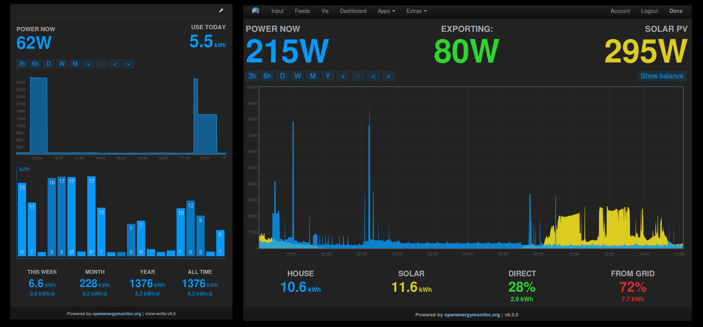

# Emoncms App Module

## Application specific dashboards

* **MyElectric**
Power + Kwh/D

* **MySolar**
Solar power generated Vs. consumed

* **MySolar (with divert)**
Solar power generated Vs. consumed, with special handling for excess generation that's been diverted to an immersion/electric car/etc.

* **MyHeatpump**
Statistics

* **MyEnergy**
Same as My Solar plus live grid carbon intensity and wind turbine output

# Install

    cd /var/www/emoncms/Modules
    git clone https://github.com/emoncms/app

Make sure to check for database updates in **Emoncms > Admin**.

## Settings

Optionally, if certain apps are not possible to be created, as e.g. their configurations do not apply for certain countries, a blacklist may be maintained in the `settings.php` file.  
To use this functionality, simply edit the default settings file

    sudo nano /var/www/emoncms/settings.ini

And add the following lines to the bottom of the file, to e.g. blacklist all *Time of use* apps:

#### App module settings

    [app]
    ; csv list of hidden apps
    hidden = template

