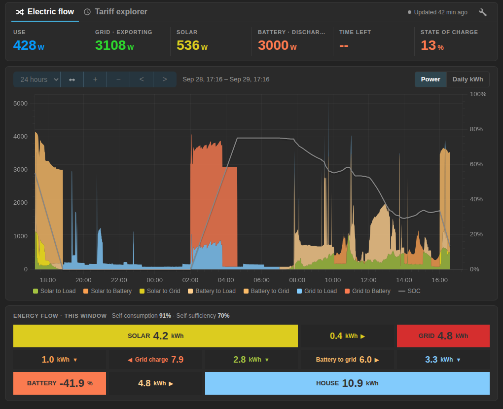
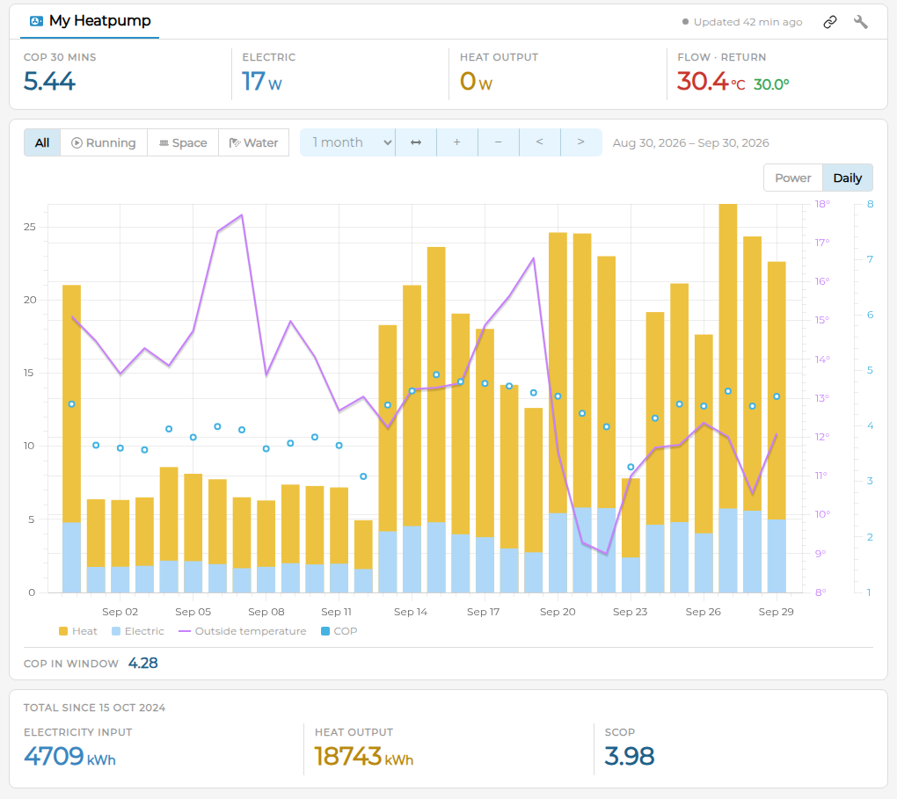
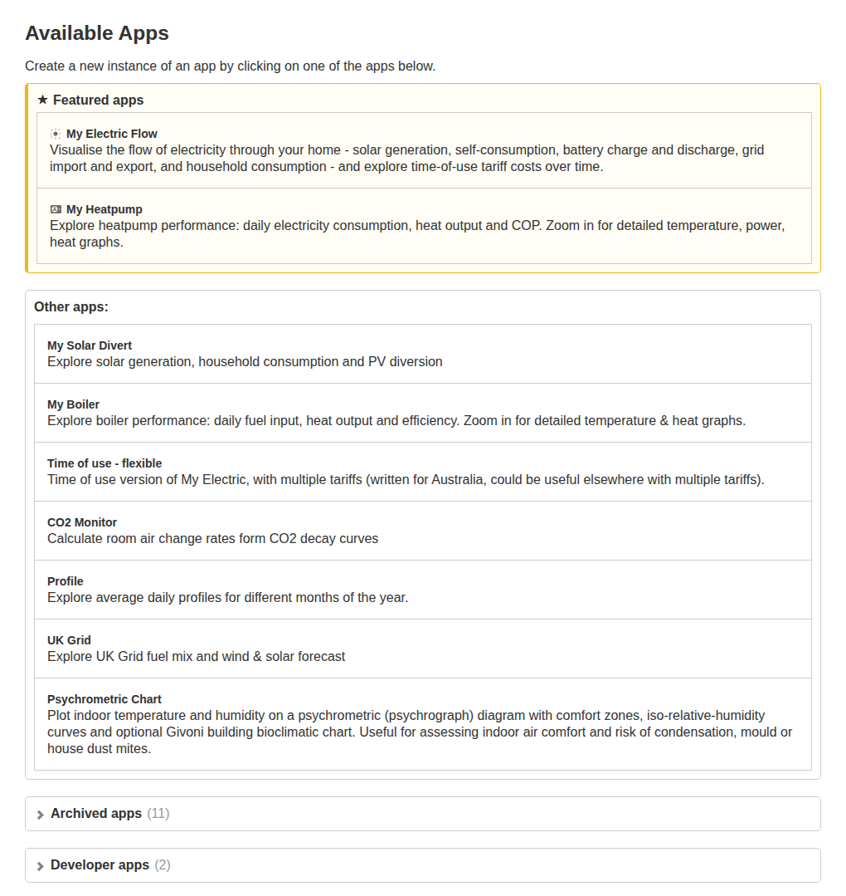

# Emoncms App Module

Application specific dashboards for emoncms. Each app is set up once with the feeds it needs and then shows live values, charts and totals for one system, such as a home electricity and solar system or a heat pump.

## Adding an app

Go to **Apps** and select **New** to open the list of available apps. Select an app to create it and give it a name.

A new app opens on its configuration page. Feeds with the expected names are connected automatically. Select a feed to change it. Required feeds must be set before the app can be launched. Optional feeds add extra detail when present.

## Apps

Featured:

- **My Electric Flow**: solar generation, self-consumption, battery charge and discharge, grid import and export and household use, with a time-of-use tariff explorer.
- **My Heatpump**: daily electricity use, heat output and COP. Zoom in for detailed temperature, power and heat graphs.

Other apps:

- **My Solar Divert**: solar generation and household use with diversion to an immersion heater or electric car.
- **My Boiler**: daily fuel input, heat output and efficiency.
- **Time of use - flexible**: consumption split across multiple tariff bands.
- **CO2 Monitor**: room air change rates from CO2 decay curves.
- **Profile**: average daily profiles for each month of the year.
- **UK Grid**: UK grid fuel mix and wind and solar forecast.
- **Psychrometric Chart**: indoor temperature and humidity on a psychrometric chart with comfort zones.

Older apps are listed under **Archived apps**: My Electric, My Electric 2, My Solar, My Solar Battery, My Energy, Time of use, Time of use cost comparison, Feed-in tariff, Octopus Agile, Solar Battery Simulator and Storage Simulator. They still work. Most are covered by My Electric Flow.

**Developer apps** are examples for writing new apps.

## Install

    cd /var/www/emoncms/Modules
    git clone https://github.com/emoncms/app

Check for database updates in **Admin** after installing or updating.

## Settings

Settings go in the `[app]` section of `/var/www/emoncms/settings.ini`:

    [app]
    ; Comma separated list of apps to hide from the app list
    hidden = template,timeofuse
    ; Check and migrate the app module database tables on load
    auto_migrate = true

App names are the folder names under `apps/`.

## Writing an app

Each app is a folder under `apps/` or `apps/OpenEnergyMonitor/` with:

- `app.json`: `title`, `description` and `order` in the list. Optional `icon` (an emoncms `svg-icon-*` class), and `primary`, `archived` or `developer` to choose the group in the list.
- `<name>.php`: the app view, with its feed and option settings in `config.app`.

`apps/template` is a minimal working example. Apps share the layout and components in `Views/css/app-kit.css`, described in the emoncms design guide (`docs/design/css-guide.md`).
